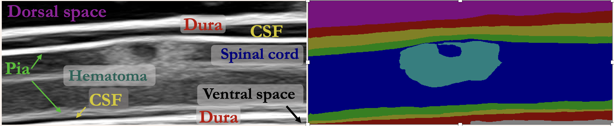

## Continuous evaluation of clinical metrics necessitates integrated computer vision algorithms to detect relevant features from ultrasound images. 

---

### Clinical motivation 

Spinal cord injury (SCI) often leads to adverse physiological effects following the initial trauma, including reduced blood flow to the injury site (hematoma). This secondary injury may last for weeks or months and inhibits patient recovery. The standard treatment approaches do not guarantee sufficient local blood flow restoration, and optimally titrating new therapies remains a challenge due to the lack of real-time and automatic monitoring of spinal cord parameters such as hematoma development and tissue inflammation. Ultrasound allows continuous, real-time imaging, and there there are several research efforts on wearable and implantable ultrasound based devices for clinical applications. However, continuous evaluation of clinical metrics necessitates integrated computer vision algorithms to detect relevant features from ultrasound images. To address this, we explore the efficacy of deep learning models for automatic hematoma tracking and anatomical segmentation on our comprehensive ultrasound dataset of 10,223 images of 25 porcine spinal cords. We also evaluate the zero-shot generalization capabilities of the segmentation models on human ultrasound spinal cord images to determine whether training on our porcine dataset is sufficient for these models to accurately interpret human data for clinical translation.

### Injury Localization 
YOLOv8 is able to localize the injury site in porcine ultrasound spinal cord images with a mean Average Precision (mAP50-95) of 0.606 and mAP50 of 0.979. 

### Soft-tissue segmentation
With DeepLabv3, we were able to achieve a mean Dice score of 0.587 on porcine spinal cord and SAMed generalizes best to human spinal cord with a mean Dice score of 0.445. By automating diagnostics within ultrasound, clinical workflows for personalized treatment paradigms can be augmented without overburdening clinicians. The significance of this research effort is highlighted by ultra-sound's unique capability for real-time imaging, providing continuous insights on patient health. With the rapidly evolving field of ultrasound imaging, enabling high resolution and dense datasets, the benefits of deep learning can be realized across diverse healthcare settings. 

### More information
This work is under review and will be published with a journal shortly. Upon acceptance, the porcine spinal cord dataset will also be publically available. 

