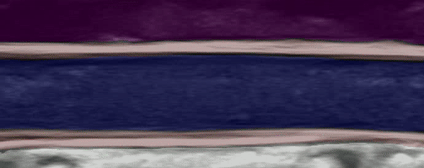

## Continuous evaluation of clinical metrics necessitates integrated computer vision algorithms to detect relevant features from ultrasound images. 

---

My research efforts have centered on developing tools for automating and aiding with diagnostics in spinal cord injury. Using ultrasound and wearable technology, we can monitor patient health continuously with ultrasonic imaging. Rather than the current treatment paradigm, where the spinal cord is imaged for sparse and discrete time points after the injury, we can continuously evaluate the spinal cord. However, this can be a time- and cost-intensive task for radiologists, presenting a need for automated image processing. 

To address this, I have developed a unique dataset of over 10,000 spinal cord images with and without injury to train and evaluate machine learning models for injury localization and automatic segmentation. With this capability, the patient's swelling, inflammation, and injury development can be automatically tracked after surgery using the neural implant to inform clinicians on patient health trajectory. In the video below, you can see a fine-tuned TransUNet segmenting the anatomy of a spinal cord over the course of several cardiac cycles.  

  

This research is currently under review and will be available online soon! 

---
