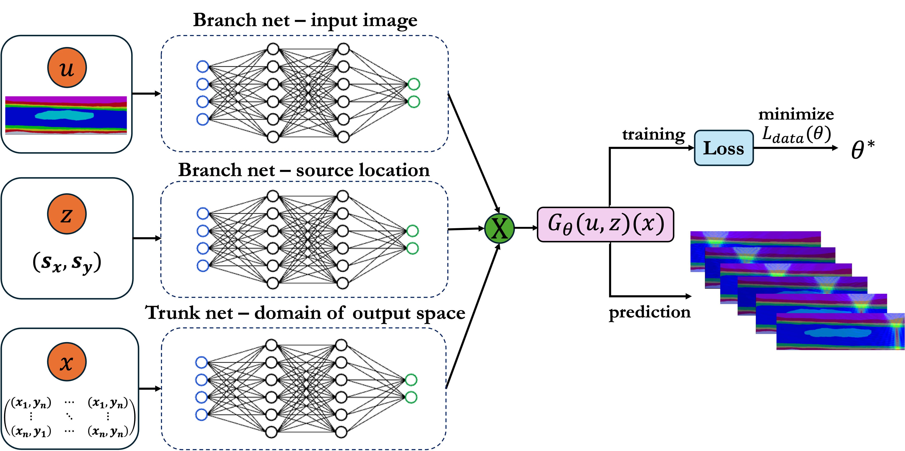

#### Combining physics and AI for rapid and precise predictions of optimal therapeutic site locations.

---

This research focuses on developing a model to enable personalized treatment plans for spinal cord injury. Understanding where to place a focused ultrasound transducer in surgery to optimize therapeutic effect requires computational simulations. Numerical solvers take too long to generate the necessary pressure maps, taking up to 5 hours to provide accurate results. The time and cost-intensive nature of this approach is unfeasible for intraoperative use-cases. My approach uses a physics-informed deep operator network trained on simulated pressure maps in the spinal cord to predict the output pressure distribution for a given patient in a matter of seconds. Regularized by physical constraints, this novel architecture learns the mappings between the patient-specific anatomy and the solution for the governing wave equation (pressure distribution) to approximate the overarching operator. This presents a paradigm-shifting solution to personalizing spinal cord care, overcoming the computational burden of running several expensive simulations. 

This work is under preparation and will be available online soon! 

---

<!-- Embed PDF Poster -->
<figure style="margin-top: 30px; text-align: center;">
  <iframe
    src="/files/IIT 2024 poster.pdf"
    width="100%"
    height="555px"
    style="border: none;"
    loading="lazy">
  </iframe>
  <figcaption style="font-size: 1rem; color: gray; margin-top: 10px;">
    My research on neural operators for rapid and personalized focused ultrasound therapy optimization was presented at the Ultrasound Symposium at the Indian Institute of Technology. 
  </figcaption>
</figure>